# 騎乘分析（bike-visualization-and-analyses）

**打開網頁：https://evantilu.github.io/bike-visualization-and-analyses/**

把 Strava 匯出的 GPX 檔丟進網頁，就能得到：

- **單趟分析**：一趟騎乘的速度地圖、海拔與速度剖面、自動分段、每公里用時、依坡度的速度，以及回放動畫。
- **兩趟比較**：同一條路線騎兩次，看哪裡變快、哪裡變慢、差幾秒，還有兩趟同時出發的**虛擬對騎**動畫。

所有計算都在你自己的瀏覽器裡進行，GPX 不會上傳到任何地方，也不需要登入或付費。

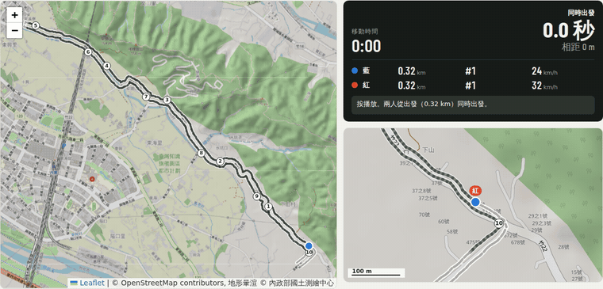


**目錄**：[三步驟開始](#三步驟開始) ｜ [單趟分析](#單趟分析) ｜ [兩趟比較](#兩趟比較) ｜ [怎麼從 Strava 下載 GPX](#怎麼從-strava-下載-gpx) ｜ [隱私與費用](#隱私與費用) ｜ [方法與限制](#方法與限制) ｜ [開發](#開發)

---

## 三步驟開始

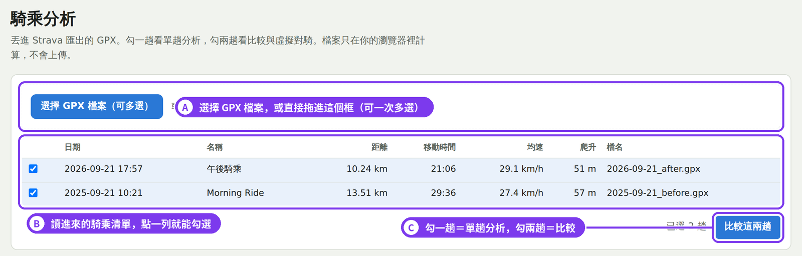

- **A｜選擇檔案**：按「選擇 GPX 檔案」或把檔案拖進框裡。可以一次選很多個，例如把整個存放 GPX 的資料夾全選。
- **B｜騎乘清單**：每個檔案列出日期、名稱、距離、移動時間、均速、爬升，最新的排最上面。點一列就能勾選，最多勾兩趟。
- **C｜開始分析**：勾一趟，按鈕會變成「分析這一趟」；勾兩趟，變成「比較這兩趟」。報告會出現在下方。

報告最上面有「列印／存成 PDF」按鈕，想留存可以用它存成 PDF。

> 建議把 GPX 都放在同一個資料夾（例如 iCloud Drive），每次從那裡多選。網頁本身不會記住任何檔案，關掉就清空。

---

## 單趟分析

### 摘要與速度地圖

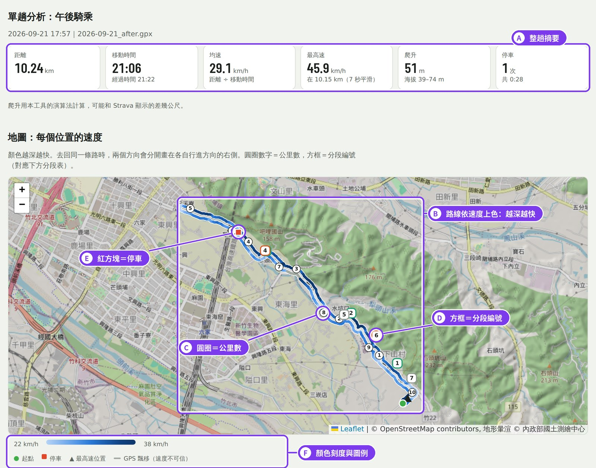

- **A｜整趟摘要**：距離、移動時間（自動暫停不算，和 Strava 一致）、均速、最高速、爬升、停車次數。
- **B｜速度地圖**：路線依速度上色，**越深越快**。去回同一條路時，兩個方向會分開畫在各自行進方向的右側（就像靠右行駛），所以去程和回程不會疊在一起。
- **C｜圓圈數字＝公里數**，和下方圖表的橫軸一致。
- **D｜方框數字＝分段編號**，對應下方的「自動分段」表。方框邊框顏色代表坡度類型。
- **E｜紅色方塊＝停車的位置**。
- **F｜圖例**：速度色帶的範圍，以及起點（綠點）、最高速位置（▲）、GPS 飄移路段（灰色）的標記。

地圖可以拖曳、縮放。

### 海拔與速度剖面（和地圖連動）

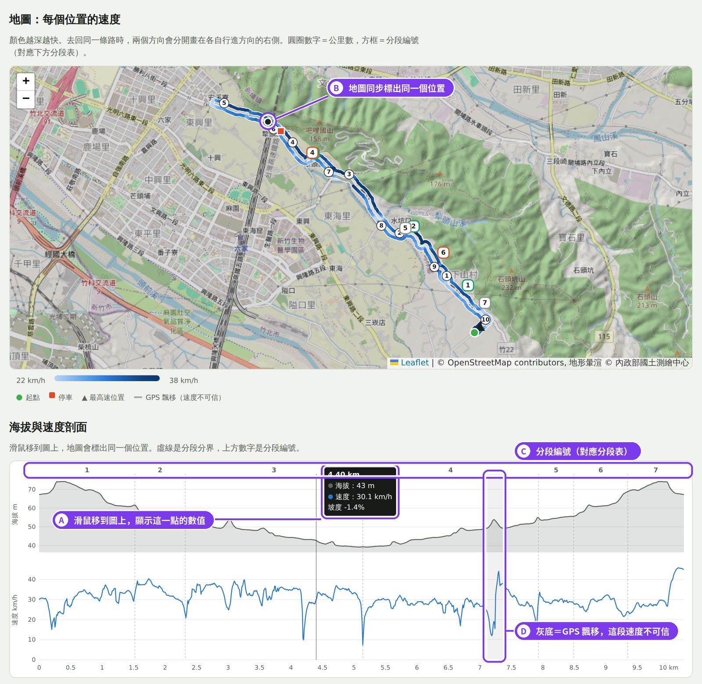

- **A｜滑鼠移到圖上**：顯示這個位置的公里數、海拔、速度、坡度。手機可以用手指滑動。
- **B｜地圖同步**：地圖上會出現一個黑點，標出同一個位置，方便對照「剖面上的這個低谷是在哪裡」。
- **C｜分段編號**：上方的數字和虛線是分段的邊界。
- **D｜灰底＝GPS 飄移**：定位延遲後一次補上的路段。這裡的逐點速度會出現假的尖峰，看的時候可以忽略；段落總時間仍然準確。

如果 GPX 裡有心率、踏頻、功率或溫度（例如有接心率帶），剖面會自動多出對應的圖。

### 自動分段

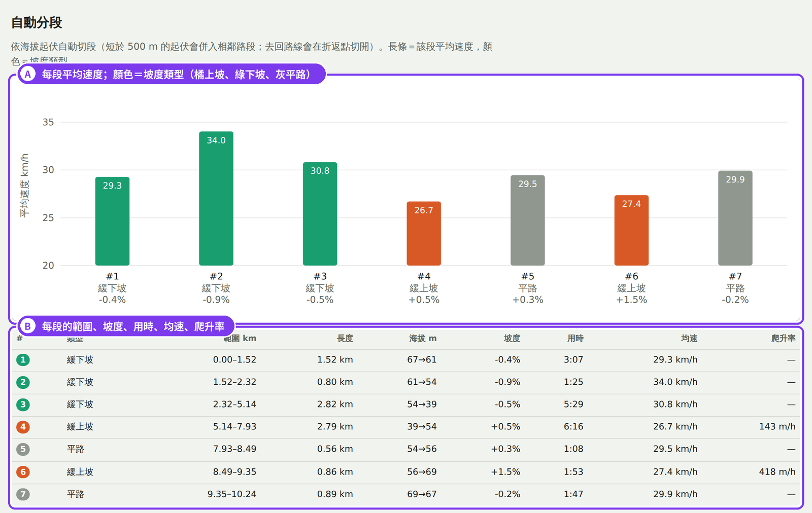

- **A｜每段平均速度**：長條高度是均速，顏色是坡度類型（橘＝上坡、綠＝下坡、灰＝平路），下方寫著分段編號、類型和平均坡度。
- **B｜分段表**：每段的範圍、長度、海拔變化、坡度、用時、均速。爬坡段另外列出「爬升率」（每小時爬升幾公尺），這是衡量爬坡能力常用的指標。

分段是依海拔起伏自動切的：短於 500 m 的小起伏會併入相鄰路段，去回路線會在折返點切開。

### 每公里用時、依坡度的速度

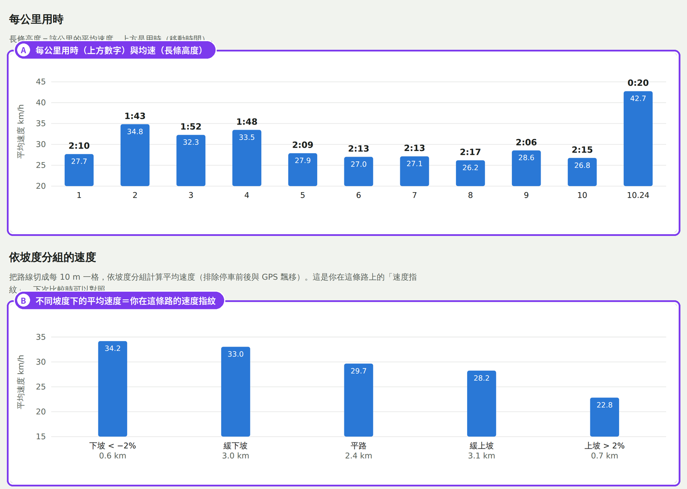

- **A｜每公里用時**：上方數字是這一公里花的時間，長條高度是這一公里的均速。
- **B｜依坡度分組的速度**：把路線切成每 10 m 一格，依坡度分成下坡、緩下坡、平路、緩上坡、上坡五組，算出各組的平均速度（停車前後和 GPS 飄移會排除）。這可以看成你在這條路上的「速度指紋」：下次騎同一條路，拿這張圖對照，就知道是爬坡變快還是平路變快。

### 回放

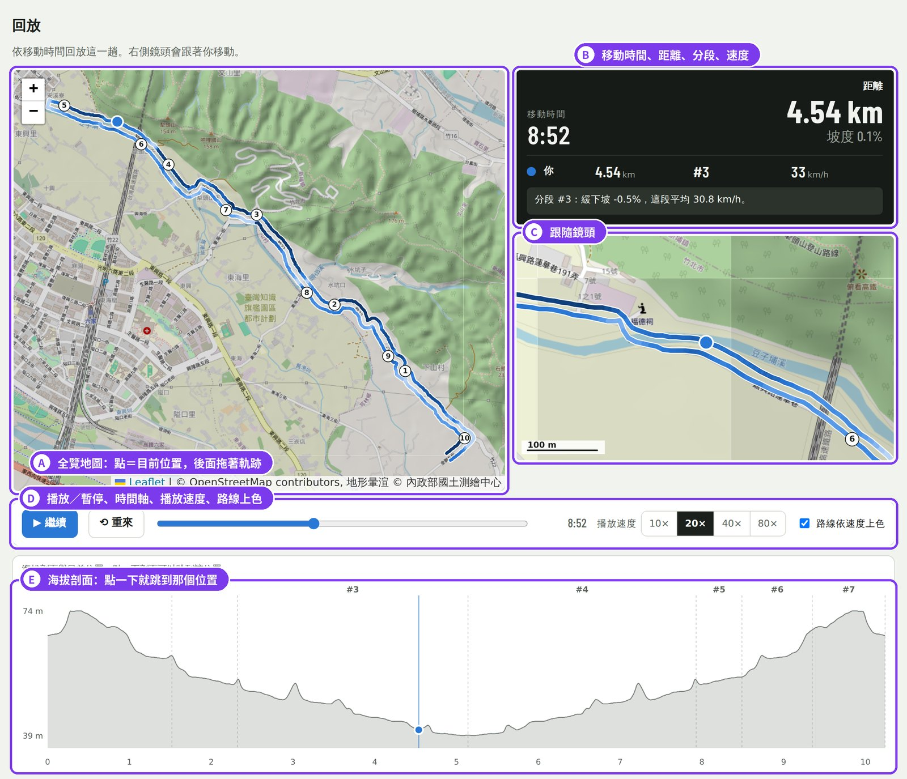

- **A｜全覽地圖**：藍點是目前位置，後面拖著一段軌跡；軌跡越長代表速度越快。
- **B｜看板**：移動時間、目前距離、所在分段、當下速度與坡度，以及這一段的說明。
- **C｜跟隨鏡頭**：自動追著藍點，看得到路況細節。
- **D｜控制列**：播放／暫停、拖曳時間軸、播放速度（10×–80×），也可以開關「路線依速度上色」。
- **E｜海拔剖面**：直線是目前位置，**點一下剖面就會跳到那個位置**。

---

## 兩趟比較

勾兩趟後按「比較這兩趟」。預設**日期較新的一趟是藍色、較舊的是紅色**，可以對調。

### 結論摘要

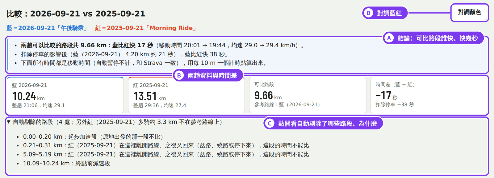

- **A｜結論**：兩趟都騎過、可以比較的路段有多長，藍比紅快（或慢）幾秒、均速各是多少。如果有停車，也會算出「扣除停車影響」後的差距。
- **B｜兩趟資料**：各自的整趟距離、移動時間、均速，以及可比路段的時間差（負數＝藍比較快）。
- **C｜自動剔除的路段**：點開可以看到哪些路段沒有拿來比、原因是什麼，例如原地起步的前 200 m、某一趟繞進岔路又回來的地方、只有一趟騎過的支線。
- **D｜對調藍紅**：想讓舊的那趟當藍色時按這裡。

### 兩趟路線對齊

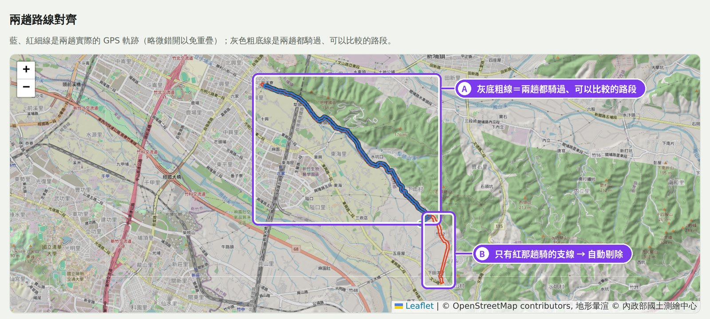

- **A｜灰底粗線**：兩趟都騎過、真正拿來比較的路段。藍、紅細線是兩趟實際的 GPS 軌跡（稍微錯開，避免完全疊在一起）。
- **B｜只有一趟騎過的路段**（這裡是紅那趟多騎的一條支線）：沒有灰底，會自動剔除，不影響比較結果。

工具會自動判斷哪一趟當「參考路線」（完整落在另一趟路線上的那一趟），下面所有圖表的橫軸都是參考路線上的距離。

### 四層疊圖

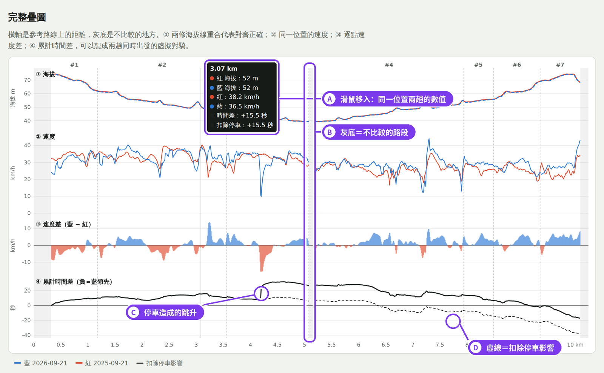

四張圖共用同一條橫軸（參考路線上的距離），由上到下：

1. **① 海拔**：兩條線應該幾乎完全重合，代表兩趟對齊正確。
2. **② 速度**：同一個位置兩趟各騎多快。
3. **③ 速度差**（藍 − 紅）：藍色面積＝藍那趟在這裡比較快，紅色面積＝紅那趟比較快。
4. **④ 累計時間差**：想像兩趟同時出發的虛擬對騎。曲線往下代表藍逐漸領先，往上代表紅逐漸領先；**曲線在哪一段變化最大，就是差距在哪裡拉開的**。

圖上的標註：

- **A｜滑鼠移入**：同一個位置兩趟的海拔、速度和當下的累計時間差。
- **B｜灰底＝不比較的路段**：這裡的時間不計入，曲線會直接跨過去。
- **C｜停車造成的跳升**：某一趟停車時，時間差會突然跳一段。
- **D｜虛線＝扣除停車影響**：把停車那一小段改用停車前的配速推算，看看「如果沒停車」差多少。

### 速度差地圖

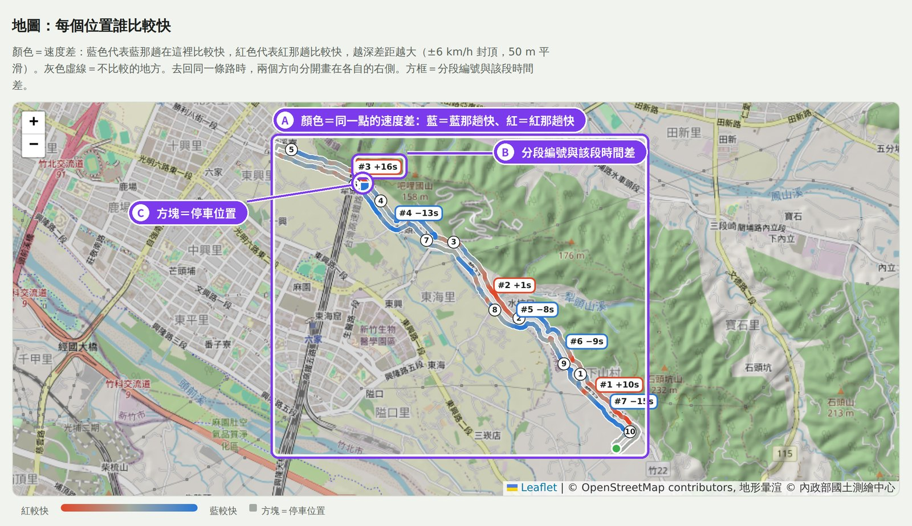

- **A｜路線顏色＝同一個位置的速度差**：藍＝藍那趟在這裡比較快，紅＝紅那趟比較快，顏色越深差距越大（±6 km/h 封頂）。去回同一條路時，兩個方向分開畫在各自的右側。灰色虛線是不比較的地方。
- **B｜分段方框**：分段編號與這一段的時間差，例如「#3 +16s」代表藍在第 3 段慢了 16 秒。
- **C｜方塊＝停車位置**，顏色代表是哪一趟停的。

滑鼠移到四層疊圖上時，這張地圖也會標出同一個位置。

### 分段比較

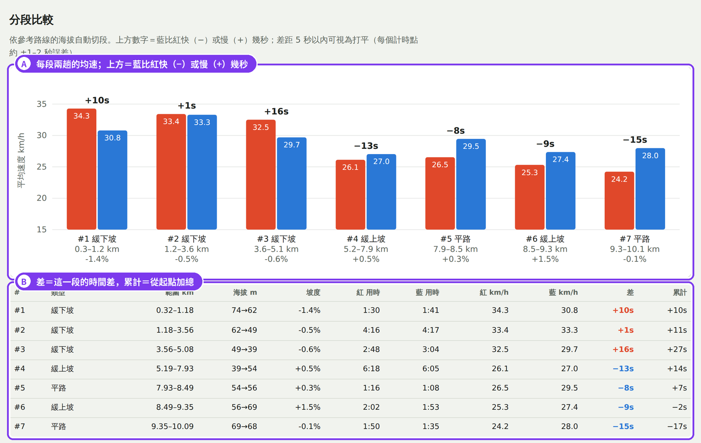

- **A｜每段兩趟的均速**（紅、藍並排），上方數字是藍比紅快（−）或慢（+）幾秒。
- **B｜分段表**：差＝這一段的時間差，累計＝從起點加總到這一段結束。

每個計時點大約有 ±1–2 秒的誤差，**差距在 5 秒以內的分段可以視為打平**。

### 依坡度比較

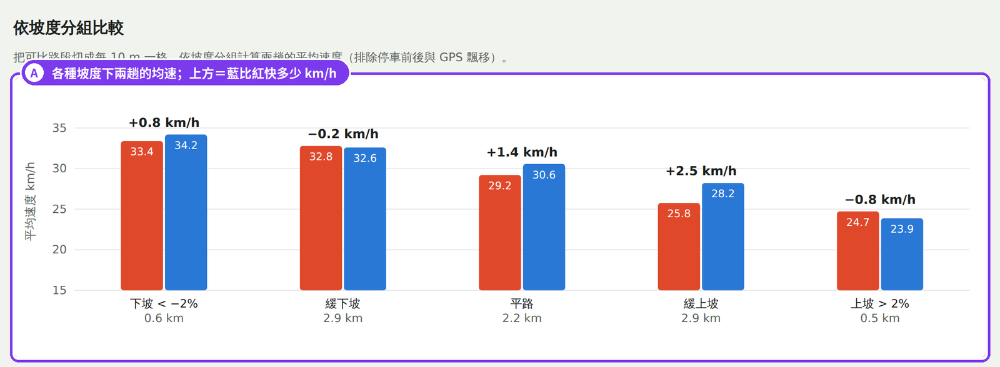

- **A｜各種坡度下兩趟的均速**，上方是藍比紅快多少 km/h。可以看出進步集中在爬坡、平路還是下坡，例如「下坡一樣快、爬坡快了 2 km/h」。

### 虛擬對騎

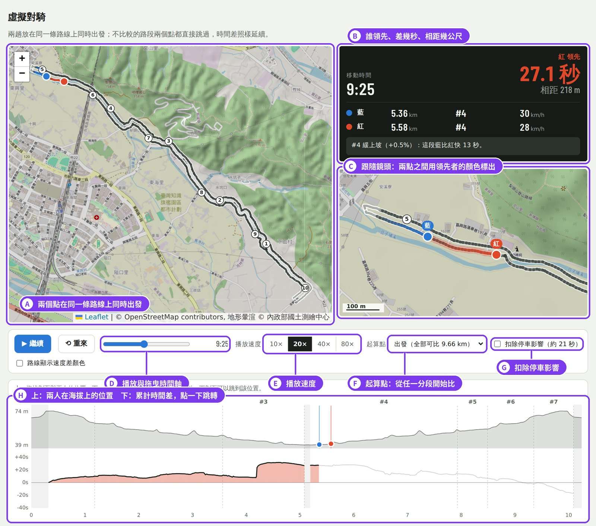

- **A｜全覽地圖**：藍、紅兩點在同一條路線上同時出發，各自照實際騎的速度前進。遇到不比較的路段時，兩點會直接跳過，時間差照樣延續。
- **B｜看板**：誰領先、領先幾秒、相距幾公尺，兩人各自的位置、分段、速度，以及當下的說明（例如「藍在這裡停車」「略過這段，因為紅繞進岔路」）。
- **C｜跟隨鏡頭**：自動追著兩個點並調整遠近，兩點之間的距離用領先者的顏色標出來。
- **D｜播放與時間軸**：播放、暫停、重來、拖曳到任意時間。
- **E｜播放速度**：10×、20×、40×、80×。
- **F｜起算點**：預設從可比路段的起點開始；也可以選任一分段的起點，只比某一段之後的部分（例如「只比回程爬坡」）。
- **G｜扣除停車影響**：勾選後，停車那一小段改用停車前的配速推算。
- 控制列上還有「路線顯示速度差顏色」，打開後路線會換成速度差地圖的顏色。
- **H｜海拔與時間差**：上半部是兩人在海拔剖面上的位置，下半部是累計時間差曲線（邊播邊畫，負值＝藍領先）。**點一下就能跳到那個位置**。

---

## 怎麼從 Strava 下載 GPX

1. 用電腦的瀏覽器打開 Strava，進入你自己的活動頁面（手機 App 通常沒有匯出選項）。
2. 在該活動頁面當中的地圖 view，選「GPX」下載圖示。
3. 把下載的 `.gpx` 檔存到固定的資料夾，之後就能一次多選來比較。

只能匯出自己的活動，所以每個人都是分析自己的騎乘。

---

## 隱私與費用

- **不上傳、不儲存**：網頁只是放在 GitHub Pages 上的靜態檔案，沒有伺服器、資料庫或登入。GPX 只在你的瀏覽器裡讀取和計算，程式裡沒有任何上傳或儲存資料的功能。
- **免費**：不使用任何付費服務或 AI。
- **會連到的外部服務**：地圖底圖來自 OpenStreetMap、地形暈渲來自內政部國土測繪中心、地圖程式庫來自 cdnjs、字型來自 Google Fonts。和一般地圖網站一樣，這些服務看得到你的 IP 與正在看的地圖範圍，但看不到你的 GPX。

---

## 方法與限制

**方法重點**

- **移動時間**：長時間沒有移動的時間間隔視為自動暫停，不計入，和 Strava 的移動時間一致；停在原地但仍在記錄的秒數會計入。
- **對齊**：以「最完整落在另一趟路線上」的那一趟為參考路線；另一趟的每個點投影到參考路線上（25 m 內、行進方向一致、只能往前推進）。去回同一條路、繞路、支線都能分辨。
- **可比路段**：自動剔除原地起步的前 200 m、終點前 150 m、任一趟離開路線又回來的地方（會依那一趟減速和加速的範圍自動加寬），以及只有一趟騎過的路段。
- **計時**：參考路線上每 10 m 一個計時點，兩趟各自用移動時間通過；虛擬對騎把各段接起來，時間差連續累計。
- **扣除停車影響**：停車點前 100 m 到後 130 m，改用該趟停車前 500 m 的配速推算。
- **GPS 飄移**：連續兩個以上明顯過快的 1 秒位移（定位延遲後一次補上）會被標記，這個範圍的逐點速度不採用。

**限制**

- GPX 只有位置、海拔、時間（有心率、踏頻、功率、溫度時會自動顯示）。沒有功率時，無法分辨進步來自車還是人；風向、氣溫、路況、體能也都會影響結果。
- 目前只用少數騎乘測試過。環線、多圈、GPS 訊號很差的路線，自動對齊和分段可能不準。
- 爬升用本工具的演算法計算，可能和 Strava 差幾公尺。
- 分段差距 5 秒以內可以視為打平。

---

## 開發

純靜態網頁，沒有建置步驟：

```
npm run serve     # http://localhost:8000
npm test          # 回歸測試（需要 private/fixtures/ 裡的測試 GPX，這個資料夾不會進版控）
```

- `js/gpx.js` GPX 解析　`js/ride.js` 單趟前處理　`js/compare.js` 兩趟對齊與計時
- `js/single.js`、`js/comparison.js` 報告　`js/player.js` 回放／虛擬對騎　`js/maps.js`、`js/charts.js` 地圖與圖表

**重新產生 README 的示範圖**（需要 Python、Playwright + Chromium、ffmpeg）：

```
python3 tools/privacy_trim.py private/demo 600 private/fixtures/<舊>.gpx private/fixtures/<新>.gpx   # 剪掉起終點
npm run serve &
python3 tools/capture_raw.py http://localhost:8000/ private/shots private/demo/<舊>.gpx private/demo/<新>.gpx
python3 tools/annotate.py private/shots docs/images         # 加上 A、B、C… 標註
python3 tools/capture_gif.py http://localhost:8000/ docs/images/race.gif private/demo/<舊>.gpx private/demo/<新>.gpx
```

標註位置寫在 `tools/annotate.py` 的 `SPEC`，介面改版後要跟著調整座標。

底圖 © OpenStreetMap contributors；地形暈渲 © 內政部國土測繪中心。
